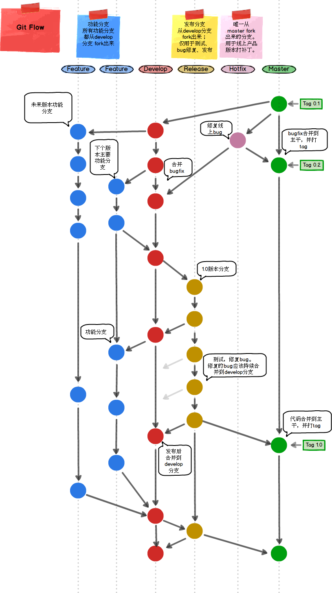

Gitflow 流程图
==============

## 参考
1. [comparing-workflows](https://www.atlassian.com/git/tutorials/comparing-workflows)
2. [git-workflows-for-pros-a-good-git-guide](https://www.toptal.com/git/git-workflows-for-pros-a-good-git-guide)
3. [git-branching-model](https://nvie.com/posts/a-successful-git-branching-model/)
4. [gitlab_flow](https://docs.gitlab.com/ee/workflow/gitlab_flow.html)
5. [Git三大特色之WorkFlow(工作流)](https://blog.csdn.net/qq_32452623/article/details/78905181)
6. [workflow-gitflow](https://github.com/oldratlee/translations/blob/master/git-workflows-and-tutorials/workflow-gitflow.md)
7. [git-tutorial](https://git-tutorial.readthedocs.io/zh/latest/rebase.html#id1)
