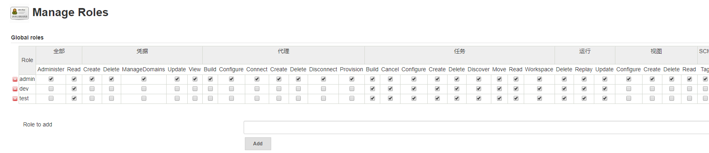
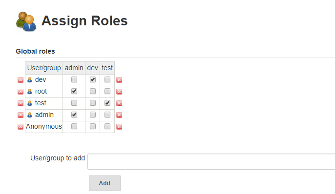

# jenkins 配置用户权限

## 安装插件

> 系统管理 -> 插件管理 -> 可选插件

输入框中输入 `Role-based Authorization Strategy` 并安装。

## 选择授权策略

> 系统管理 -> 全局安全配置 -> 授权策略

选择 `Role-Based Strategy` 并保存


## 配置角色

> 系统管理 -> `Manage and Assign Roles`


### 配置全局角色

配置管理员角色


配置一个 test 角色


配置开发者 `dev` 角色


### 配置项目角色

配置角色名为 `test`，项目命名规则为 `test_*` 的项目角色


配置角色名为 `dev`，项目命名规则为 `dev*` 的项目角色


### 为用户分配角色

添加用户到 `Global roles` 列表，用户信息在 系统管理 -> 管理用户 中查看


添加用户并为用户分配角色




## 测试验证


## 通过 Jenkins 配置文件进行修改

### 找到 jenkins 配置文件 config.xml

默认 `JENKINS_HOME` 路径为 `/root/.jenkins`

进入 `JENKINS_HOME` 目录
```bash
[root@server-test-211 jenkins]# cd /root/.jenkins

```

查看目录文件
```bash
[root@server-test-211 .jenkins]# ll
total 212
-rw-r-----.  1 root root  6344 May  7 11:51 config.xml
-rw-r-----.  1 root root  3376 May  7 09:58 credentials.xml
...
```

### 编辑 `config.xml` 文件
```bash
[root@server-test-211 .jenkins]# vi config.xml
```

```xml
<?xml version='1.1' encoding='UTF-8'?>
<hudson>
  <disabledAdministrativeMonitors/>
  <version>2.175</version>
  <installStateName>RUNNING</installStateName>
  <numExecutors>2</numExecutors>
  <mode>NORMAL</mode>
  <useSecurity>true</useSecurity>
  <authorizationStrategy class="com.michelin.cio.hudson.plugins.rolestrategy.RoleBasedAuthorizationStrategy">
    <roleMap type="globalRoles">
      <role name="admin" pattern=".*">
        <permissions>
          <permission>hudson.model.View.Delete</permission>
          <permission>hudson.model.Computer.Connect</permission>
          <permission>hudson.model.Run.Delete</permission>
          ...
        </permissions>
        <assignedSIDs><!-- 用户ID| 具备admin权限 -->
          <sid>root</sid>
          <sid>zkz</sid>
        </assignedSIDs>
      </role>
      <role name="dev" pattern=".*">
        <permissions>
          <permission>hudson.model.Hudson.Read</permission>
          <permission>hudson.model.Item.Cancel</permission>
          ...
        </permissions>
        <assignedSIDs>
          <sid>dev</sid>
        </assignedSIDs>
      </role>
      <role name="test" pattern=".*">
        <permissions>
          <permission>hudson.model.Hudson.Read</permission>
          <permission>hudson.model.Item.Cancel</permission>
          <permission>hudson.model.Item.Delete</permission>
           ...
        </permissions>
        <assignedSIDs>
          <sid>test</sid>
        </assignedSIDs>
      </role>
    </roleMap>
    <roleMap type="projectRoles">
      <role name="dev" pattern="dev_*">
        <permissions>
          <permission>hudson.model.Item.Cancel</permission>
          <permission>hudson.model.Item.Read</permission>
          <permission>hudson.model.Item.Workspace</permission>
          <permission>hudson.model.Item.Build</permission>
        </permissions>
        <assignedSIDs/>
      </role>
      <role name="test" pattern="test_*">
        <permissions>
          <permission>hudson.model.Item.Cancel</permission>
          <permission>hudson.model.Item.Read</permission>
          <permission>hudson.model.Item.Build</permission>
        </permissions>
        <assignedSIDs/>
      </role>
    </roleMap>
  </authorizationStrategy>
  <nodeProperties/>
  <globalNodeProperties/>
</hudson>
```
配置文件修改完后，需重启服务。

### 重启服务

> 选择其中一种方式

1. 重启 Jenkins
   
   [重启Jenkins服务](jenkins-normal-command.md)

2. 重启 Tomcat

```bash
[root@server-test-211 ~]# cd /home/kz/apache-tomcat-8.5.40/bin
[root@server-test-211 bin]# ./shutdown.sh
[root@server-test-211 bin]# ps -ef|grep java  // 查看是否还有进程
[root@server-test-211 bin]# ./shutdown.sh
```

## 参考

[JENKINS针对不同项目组对用户进行权限分配](https://www.cnblogs.com/kazihuo/p/9022899.html)