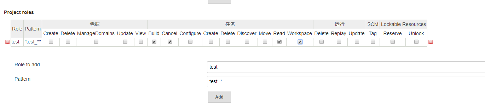

# jenkins 配置用户权限

## 安装插件

> 系统管理 -> 插件管理 -> 可选插件

输入框中输入 `Role-based Authorization Strategy` 并安装。

## 选择授权策略

> 系统管理 -> 全局安全配置 -> 授权策略

选择 `Role-Based Strategy` 并保存

## 配置角色

> 系统管理 -> `Manage and Assign Roles`

### 配置全局角色

配置一个 test 角色

### 配置项目角色

### 分配角色

