# Jenkins 配置 GitHub 项目

## Github 生成 `Personal access tokens`

> `Github: Settings -> Developer settings -> Persional access tokens`

`Generate new token` -> `Token description`(输入token描述，如：ob-test) -> `Select scopes`(选择权限， 如repo|admin:repo_hook等) -> `Generate token`

token生成后，拷贝出来备用。

## Jenkins 配置

1. 系统管理
   
   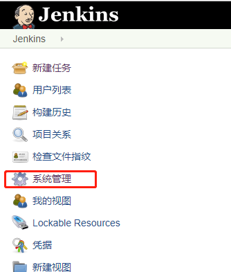

2. 系统设置
   
   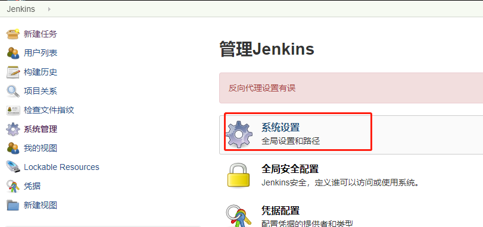

3. github server

    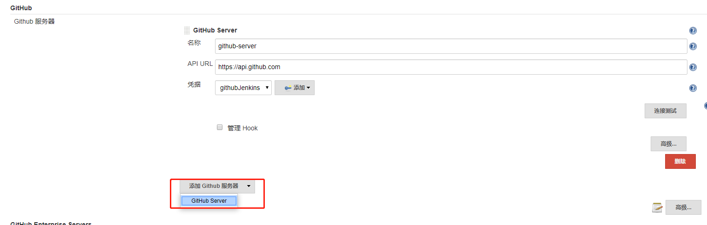

    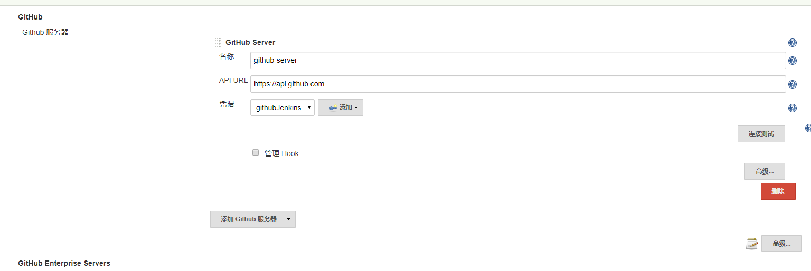

4. 添加 token 凭据
   
   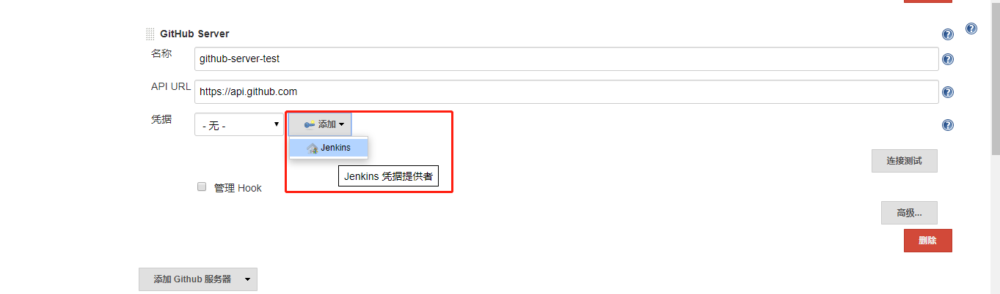

5. token 配置
   
    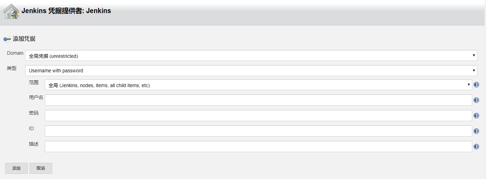

    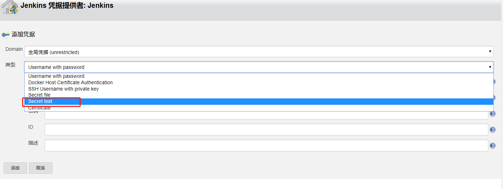

    `secret` 输入框填入 github `Persional access token`
    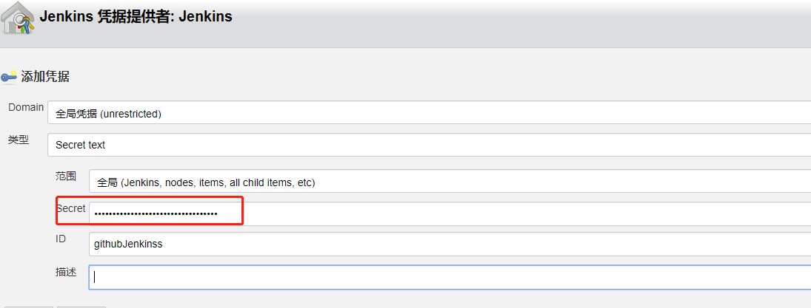

6. 选择凭据

    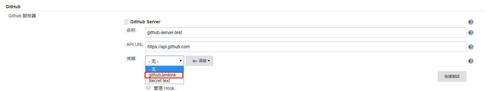

## 新建一个自由风格的项目

1. 创建项目任务

    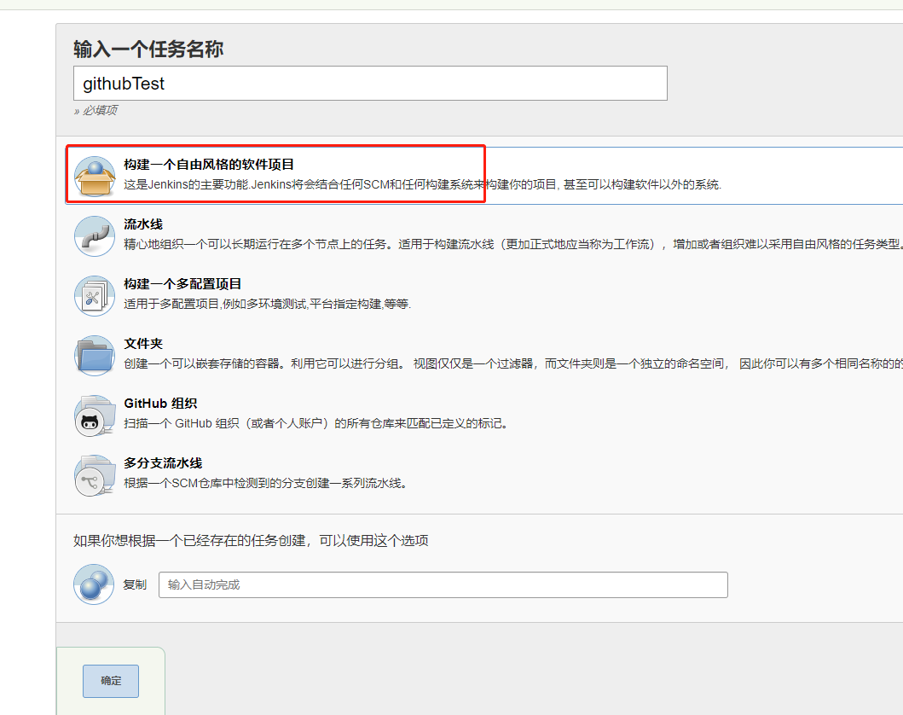

2. 配置 GitHub 项目地址

    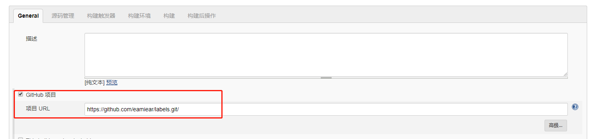

3. 源码管理配置

    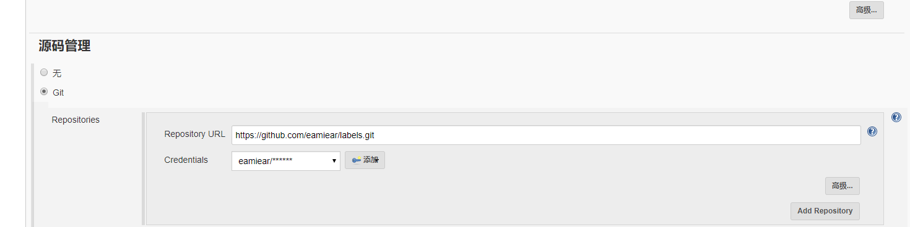

4. 配置构建脚本（shell）
   
    [jenkins build shell](jenkins-build-shell.md)

5. 保存后构建