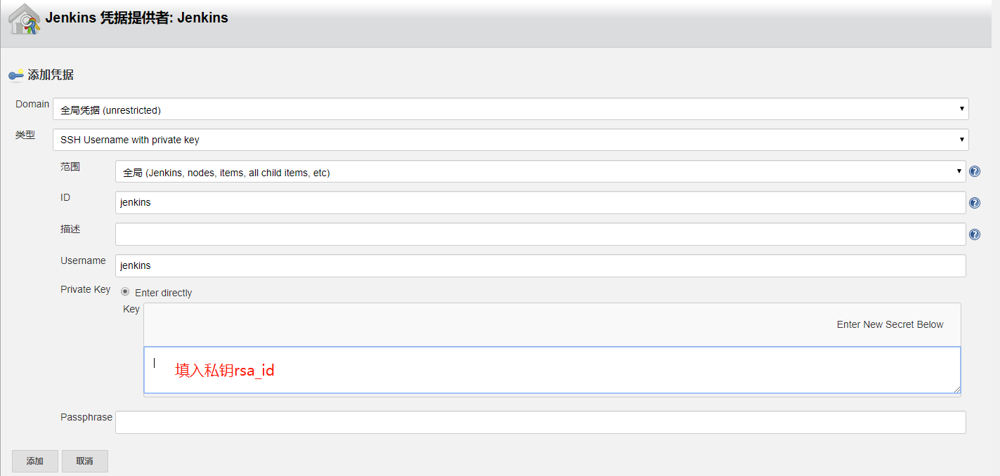
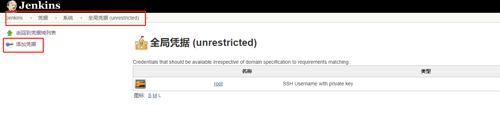
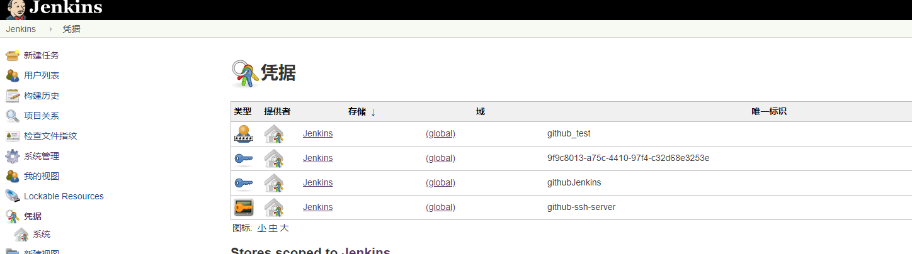
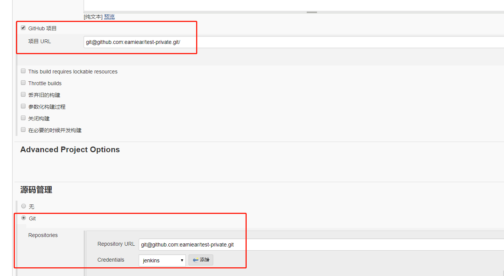

# Jenkins 配置 github 私有项目

## 创建私钥公钥

生成私钥公钥命令：
```bash
[root@server-test-211 github_test]# ssh-keygen -t rsa -C "just_k@163.com"
Generating public/private rsa key pair.
Enter file in which to save the key (/root/.ssh/id_rsa): 
Enter passphrase (empty for no passphrase): 
Enter same passphrase again: 
Your identification has been saved in /root/.ssh/id_rsa.
Your public key has been saved in /root/.ssh/id_rsa.pub.
The key fingerprint is:
65:15:6f:b7:5d:a6:44:71:bc:21:5f:6b:cb:2f:f4:ca justcall_me_k@163.com
The key's randomart image is:
+--[ RSA 2048]----+
|            o.oo.|
|           . + oo|
|          o   * O|
|         o   o O+|
|        S     +.o|
|              .o |
|             . ..|
|             .. o|
|              Eo |
+-----------------+

```

查看生成情况：

```bash
[root@server-test-211 github_test]# cd ~root/.ssh/
[root@server-test-211 .ssh]# ll
total 12
-rw-------. 1 root root 1679 May  6 14:45 id_rsa
-rw-r--r--. 1 root root  403 May  6 14:45 id_rsa.pub

```


## 将公钥添加到 GitHub

在 GitHub 上 `Settings-> SSH and GPG keys` 选项中创建 `SSH key` 并将公钥 `id_rsa.pub` 添加进入。

## 在 Jenkins 上创建凭据

系统管理 -> 系统设置 -> GitHub -> 添加凭据



或在 全局凭据中进行添加



在 "凭据" 面板中查看凭据信息


## 新建项目

> 项目链接需要使用 `SSH`， `Https` 报错

