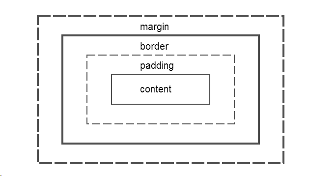
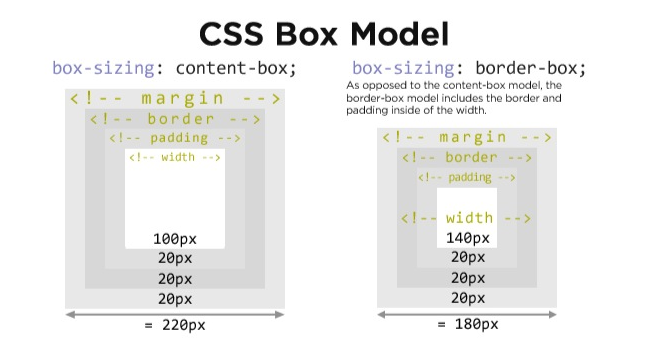
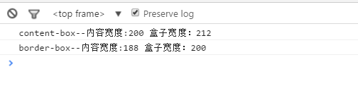
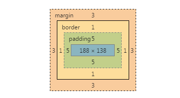
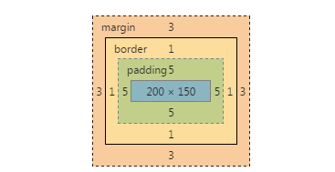
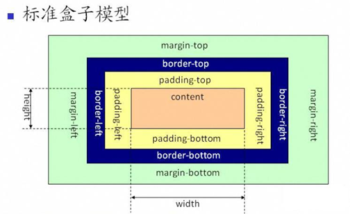
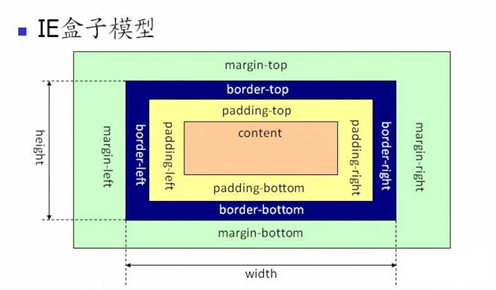

`# 盒子模型
>`web`中的每个元素都是一个盒子


###`Box-sizing`
`box-sizing`有两个属性值：`content-box`(默认)和`border-box`



- `content-box`: 实际宽度 = `padding * 2` + `border * 2` + `width`
- `border-box`: 实际宽度=`width`。`border-box`中的`width`包含了`border`和`padding`.

- `margin`对盒子本身的宽高并没有影响，只影响相邻的盒子。不纳入盒子的实际宽、高。

```

<!DOCTYPE html>
<html>
<head lang="en">
    <meta charset="UTF-8">
    <title></title>
    <style>
        .box{
            display: inline-block;
            width: 200px;
            height: 150px;

            border: 1px solid #009cda;

            margin: 3px;
            padding: 5px;

            background: #6A7991;
        }
        .bb{
            box-sizing: border-box;
        }
    </style>
</head>
<body>

<div class="box"></div>
<div class="box"></div>
<div class="box bb"></div>
</body>
<script src="libs/jquery/dist/jquery.min.js"></script>
<script>
    console.log("content-box--"+"内容宽度:"+$(".box").width(),"盒子宽度："+$(".box").outerWidth());
    console.log("border-box--"+"内容宽度:"+$(".bb").width(),"盒子宽度："+$(".bb").outerWidth());
</script>
</html>
```




对于`border-box`


可见，`border-box`设置的是盒子的宽度。如这里的宽度为200，
```
width: 200px;

border: 1px solid #009cda;
padding: 5px;
```
内容的宽度 = 盒子宽度(200) - `border * 2` - `padding * 2`
内容的宽度根据盒子的`border`和`padding`的值，自动填充。这样的好处是，避免修改`border`和`padding`值后，需要计算宽度值。  

对于`content-box`


对`padding`和`border`将影响盒子宽高


### 标准盒子模型和IE盒子模型
#### 标准模型


总宽度= 左右margin + 左右border + 左右padding + 内容宽度width
#### IE模型


总宽度= 左右margin + width (左右border + 左右padding + 内容宽度)

####**阅读**
- [magic-of-css](http://adamschwartz.co/magic-of-css/chapters/1-the-box/)
- [box-sizing](https://css-tricks.com/box-sizing/)
- [the-css-box-model](https://css-tricks.com/the-css-box-model/)
- [amazeui.org/css/base](http://amazeui.org/css/base)