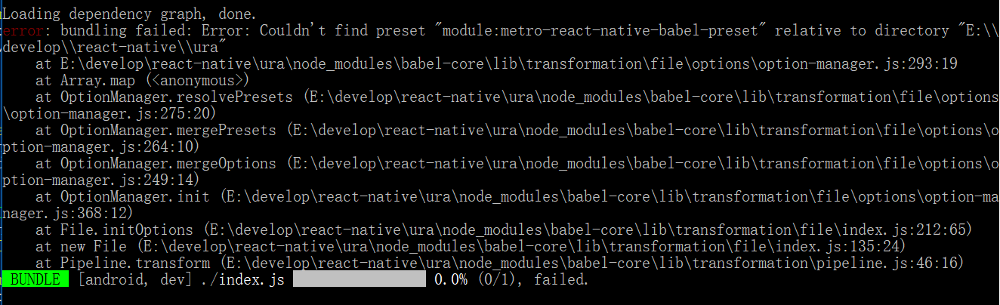
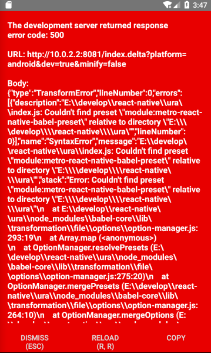

# 启动工程
> 按照官网教程搭建开发环境，并执行react-native run-android指令会出现执行错误.

1. [教程 getting-started-en](https://facebook.github.io/react-native/docs/getting-started.html)
2. [教程 getting-started-cn](https://reactnative.cn/docs/getting-started.html)






>解决方式

重新初始化工程，并指定react-native版本（最新版本可能存在问题，用相对旧的版本）

```
 react-native init newproject --version react-native@0.55.4
 ```
[参考 GitHub issues](https://github.com/react-community/create-react-native-app/issues/721#issuecomment-425305693)

执行`react-native run-android`时，需启动代理（翻墙）

成功输出：
```powershell
PS E:\develop\react-native\ura2> react-native run-android
Scanning folders for symlinks in E:\develop\react-native\ura2\node_modules (63ms)
Starting JS server...
Building and installing the app on the device (cd android && gradlew.bat installDebug)...
Incremental java compilation is an incubating feature.
:app:preBuild UP-TO-DATE
:app:preDebugBuild UP-TO-DATE
:app:checkDebugManifest
:app:preReleaseBuild UP-TO-DATE
:app:prepareComAndroidSupportAppcompatV72301Library UP-TO-DATE
:app:prepareComAndroidSupportSupportV42301Library UP-TO-DATE
:app:prepareComFacebookFbuiTextlayoutbuilderTextlayoutbuilder100Library UP-TO-DATE
:app:prepareComFacebookFrescoDrawee130Library UP-TO-DATE
:app:prepareComFacebookFrescoFbcore130Library UP-TO-DATE
:app:prepareComFacebookFrescoFresco130Library UP-TO-DATE
:app:prepareComFacebookFrescoImagepipeline130Library UP-TO-DATE
:app:prepareComFacebookFrescoImagepipelineBase130Library UP-TO-DATE
:app:prepareComFacebookFrescoImagepipelineOkhttp3130Library UP-TO-DATE
:app:prepareComFacebookReactReactNative0554Library UP-TO-DATE
:app:prepareComFacebookSoloaderSoloader010Library UP-TO-DATE
:app:prepareOrgWebkitAndroidJscR174650Library UP-TO-DATE
:app:prepareDebugDependencies
:app:compileDebugAidl UP-TO-DATE
:app:compileDebugRenderscript UP-TO-DATE
:app:generateDebugBuildConfig UP-TO-DATE
:app:mergeDebugShaders UP-TO-DATE
:app:compileDebugShaders UP-TO-DATE
:app:generateDebugAssets UP-TO-DATE
:app:mergeDebugAssets UP-TO-DATE
:app:generateDebugResValues UP-TO-DATE
:app:generateDebugResources UP-TO-DATE
:app:mergeDebugResources UP-TO-DATE
:app:bundleDebugJsAndAssets SKIPPED
:app:processDebugManifest UP-TO-DATE
:app:processDebugResources UP-TO-DATE
:app:generateDebugSources UP-TO-DATE
:app:incrementalDebugJavaCompilationSafeguard UP-TO-DATE
:app:compileDebugJavaWithJavac UP-TO-DATE
:app:compileDebugNdk UP-TO-DATE
:app:compileDebugSources UP-TO-DATE
:app:transformClassesWithDexForDebug UP-TO-DATE
:app:mergeDebugJniLibFolders UP-TO-DATE
:app:transformNative_libsWithMergeJniLibsForDebug UP-TO-DATE
:app:processDebugJavaRes UP-TO-DATE
:app:transformResourcesWithMergeJavaResForDebug UP-TO-DATE
:app:validateSigningDebug
:app:packageDebug UP-TO-DATE
:app:assembleDebug UP-TO-DATE
:app:installDebug
Installing APK 'app-debug.apk' on 'Nexus_5X_API_26(AVD) - 8.0.0' for app:debug
Installed on 1 device.

BUILD SUCCESSFUL

Total time: 22.12 secs
Running C:\Users\k\AppData\Local\Android\Sdk/platform-tools/adb -s emulator-5554 reverse tcp:8081 tcp:8081p:8081 tcp:8081                                                                            -s emulator-5554 shell am start -n com.ura2/com.Starting the app on emulator-5554 (C:\Users\k\AppData\Local\Android\Sdk/platform-tools/adb-s emulator-5554 shell am start -n com.ura2/com.ura2.MainActivity)...
Starting: Intent { cmp=com.ura2/.MainActivity }

```

## 其他技巧

1. 在StackOverflow搜索问题，使用链接
```
https://stackoverflow.com/search?q=react-native%3A+
```

2. 手动下载指定版本的gradle，并放到.gradle中。
gradle-2.14.1-all.zip可以为gradle-4.4-all.zip等版本。

```
https://downloads.gradle.org/distributions/gradle-2.14.1-all.zip
```


将gradle-2.14.1-all.zip放到`gradle-2.14.1-all/xxxx/`目录下，手动下载，避免下载过慢。


3. 启动`react-native run-android`时，需要先启动`AVD Manager`设备模拟器，没有则需要创建。创建虚拟设备需要TV-X虚拟能力加持，需要进入系统BIOS自行配置，F1进入BIOS系统，config > ... Intel virtualization，启动即可。

