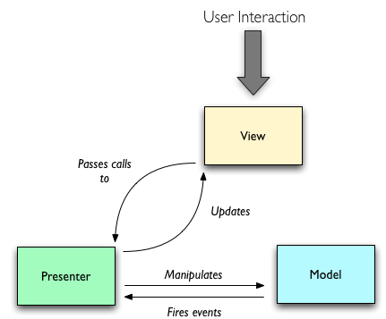

# MVP

>关于`MVP`的介绍和使用  
>`MVP`—`Model View Presenter`

- `View`接受请求，并将请求移交给`Presenter`
- `Presenter`操作`Model`数据并更新
- `Model`通知`Presenter`数据发生变化
- `Presenter`更新`View`数据

##### **`MVP`的特点**
- 各部分间的通信都是双向的
- `View`间`Model`没有通信，通过`Presenter`传递
- 根据业务逻辑的分布，有两种不同的模式：  
 * `View`中放置简单的业务逻辑，复杂的业务逻辑主要集中在`Presenter`中(`Passive View`)
 * `Presenter` 中放置全部业务逻辑，`View`中没有逻辑(`Superivising Controller`)
- `Passive View`中，为了减少UI组件的行为，使用`Controller`控制用户事件响应，并将结果更新到`View`上，以便集中测试`Controller`而减少`View`出问题的风险。
- `Superivising Controller`中的`Controller`既处理用户输入的响应，同时操作`View`来处理更加复杂的`View`逻辑
